### What is OpenFOAM?

OpenFOAM is a free, open source CFD software developed primarily by OpenCFD Ltd since 2004.
OpenFOAM (Open Field Operation and Manipulation, www.openfoam.com) is a C++ toolbox
that can be used to develop Finite Volume (FV) Method based solvers for general continuum mechanics 
problems, mostly for fluid flow and heat transfer.

OpenFOAM has a wide range of functions, such as:

- The ability to simulate anything related to the CFD area, such as: turbulent flows 
  in automotive aerodynamics, through to fires and fire suppression in buildings, 
  involving combustion, chemical reactions, heat transfer, liquid sprinklers and films.
  
- It includes tools for dealing with complex geometries (e.g., a fish pass) and for data 
  processing and visualization. 
  
- It performs parallel calculations allowing to take full advantage of today's multicore 
  processors and multiprocessor computers.
  
### Basic directory structure

The basic directory structure for a OpenFOAM case, that contains the minimum set of files required to run an application, is shown here below:
 
<p align="center">

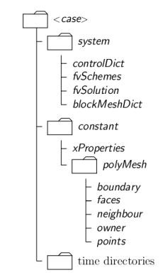
<br/>
*<sub>OpenFOAM case directory structure.</sub>*

### Constant directory

The constant directory contains all values that remain constant during the calculation. 
These are files that specify the physical properties, e.g., transport properties and turbulence 
models. The subdirectory polyMesh contains all information concerning the mesh.


*<sub>Example of the constant directory contents.</sub>*

### System directory

In this directory, it is possible to modify the parameters associated with the solution 
procedure. It contains at least the following files: controlDict  where parameters like 
the including start/end time, time step and parameters for data output are set; 
fvSchemes where the discretization schemes can be selected;  fvSolution in which the 
parameters and solver choice are set for the run. 

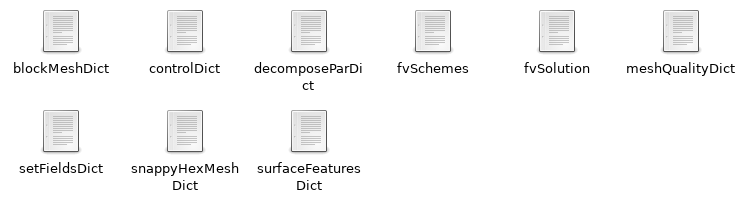
<br/>
*<sub>Example of the system directory contents.</sub>*

### Time directories

These directories contain the data files for every field of the simulation.


<br/>
*<sub>Example of the zero time step directory contents.</sub>*


### Documentation

The list below provides further sources where more information regarding OpenFOAM
can be found, including tutorials and lecture notes.

- General information about running OpenFOAM, compilation, solvers, models, 
  mesh generation and post-processing: [OpenFOAM's User Guide](https://foam.sourceforge.net/docs/Guides-a4/OpenFOAMUserGuide-A4.pdf) 
  and [OpenFOAM's Programmers Guide](https://foam.sourceforge.net/docs/Guides-a4/ProgrammersGuide.pdf)

- OpenFOAM Wiki, available at: https://openfoamwiki.net/

- The CFD Online OpenFOAM Forum, available at: https://www.cfd-online.com/Forums/openfoam/

- Various tutorials, videos and the book "Mathematics, Numerics, Derivations and 
  OpenFOAM®" can be found at: https://holzmann-cfd.com/
  
- Further video tutorials with detailed step-by-step instructions can be found at:
  [youtube.com/OpenFOAMJozsefnagy](https://www.youtube.com/@OpenFOAMJozsefNagy/)

- Lecture notes of the PhD course CFD with openSource Software, available at: 
  [tfd.chalmers.se](http://www.tfd.chalmers.se/~hani/kurser/OS_CFD/#YEAR_2022)
  
---

## Tutorial - Multiphase Solver interFoam
In this tutorial we will solve a problem of a 50-m long straight channel with
two basins, one smaller one at the inlet and a larger one at the outlet, and an
obstacle located in the middle. 

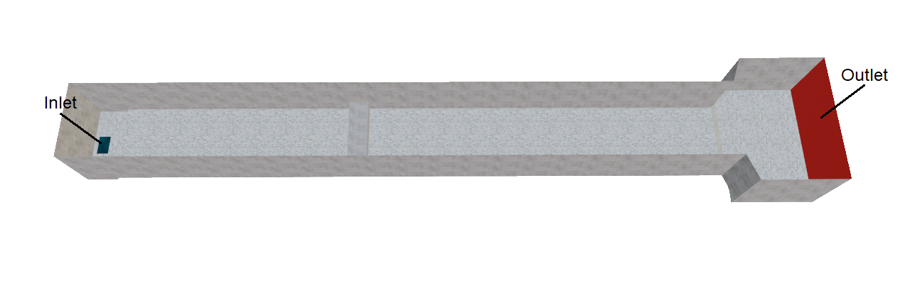
<br/>
*<sub>3D view of the analyzed structure.</sub>*

In this case we will use the multiphase solver interFoam coupled with 
a k-epsilon turbulence model. interFoam identifies the water-air interface 
based on the Volume of Fluid (VOF) method, which solves the transport 
equations for a single or multiple phase fractions alpha, where alpha is 0.5 at the 
interface between the fluids. ([OpenFOAM User Guide](https://www.openfoam.com/documentation/user-guide/a-reference/a.1-standard-solvers)). 
Additionally, we will focus on the implementation of multiple roughness zones 
related to the engineered and nature-oriented elements present in the model,
and we will apply a specific roughness height. 

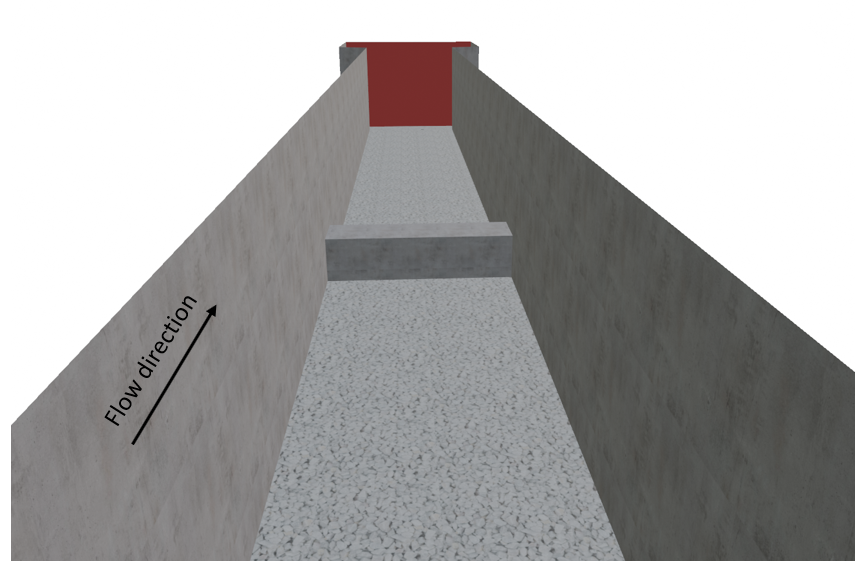
<br/>
*<sub>3D view of the analyzed structure in the flow direction highlighting the assigned materials.</sub>*

The case folder containing all the necessary files can be downloaded [here](https://github.com/hydro-informatics/openfoam.git).

***
### File import
The first section of this tutorial will be dealing with the import of the initially
created geometry. All files were created using Blender, which is a free and 
open-source 3D computer graphics software tool set. The geometry was divided
into individual elements based on their composing material and according to the 
areas to be refined in the meshing process. Therefore, for the present example, the following
elements were exported as STL files:
- Air.stl
- Concrete_sides.stl
- Gravel_bottom.stl
- Inlet.stl
- Obstacle.stl
- Outlet.stl

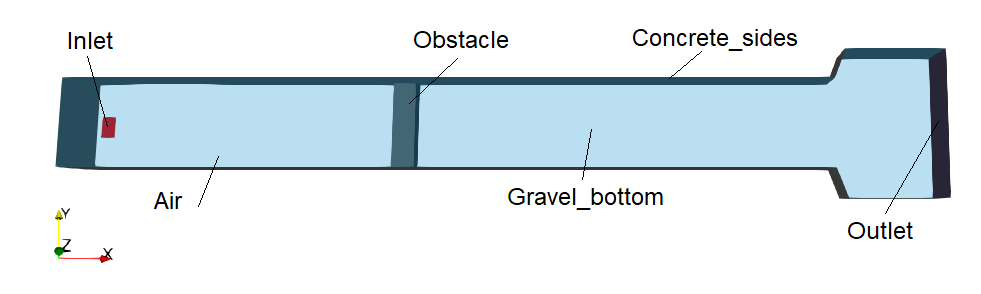
<br/>
*<sub>Constituent elements of the channel.</sub>*

When exporting the STL files from Blender, select the option *Ascii* and include 
only the selected object, as shown here below.

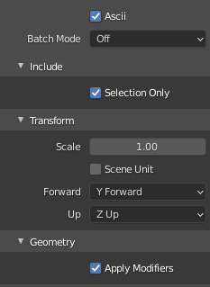
<br/>
*<sub>Settings for the export of the STL files from Blender.</sub>*

Next, before proceeding with the mesh generation, the exported STL files need
to be opened with a text editor and the first and final line need to be modified
as follows:

Substitute 
```
solid Exported from Blender-2.93.3
...
endsolid Exported from Blender-2.93.3
```
with the name of the STL files you are dealing with, for example
```
solid Gravel_bottom
...
endsolid Gravel_bottom
```
Finally, all the exported and edited STL files can be saved in the *triSurface* 
folder that will be described more in detail in the next section.
***
### Mesh generation

The mesh is an essential part of the numerical solution and must meet certain 
criteria in order to guarantee a valid and precise solution. The following 
section describes the the [<em> snappyHexMesh </em> utility](https://www.openfoam.com/documentation/user-guide/4-mesh-generation-and-conversion/4.4-mesh-generation-with-the-snappyhexmesh-utility)
for creating 3D meshes containing hexahedral and split-hexahedral cells from 
triangulated surface geometries.

Further details regarding the mesh specification and validity constraints can 
be found in [Chapter 4](https://www.openfoam.com/documentation/user-guide/4-mesh-generation-and-conversion/4.1-mesh-description#x11-290004.1)
of the OpenFOAM User Guide.

In order to run snappyHexMesh, in addition to an existing geometry
base mesh, the following files are required:

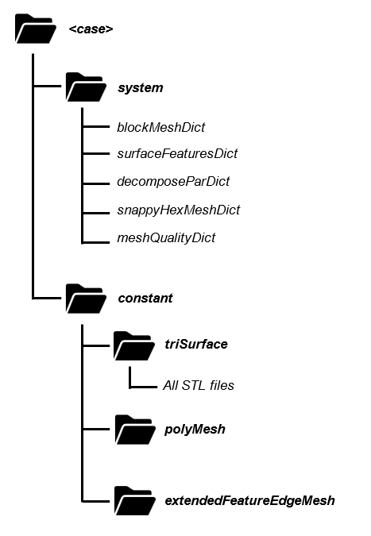
<br/>
*<sub>Case directory containing the files necessary to run snappyHexMesh.</sub>*

The following sections describe the steps that need to be followed.

#### 1. Creation of the background hex mesh
Before being able to run snappyHexMesh, a background mesh characterized by 
hexahedral cells has to be created. This mesh needs to contain the entire 
region that wants to be meshes with snappyHexMesh, as shown in the figure below.

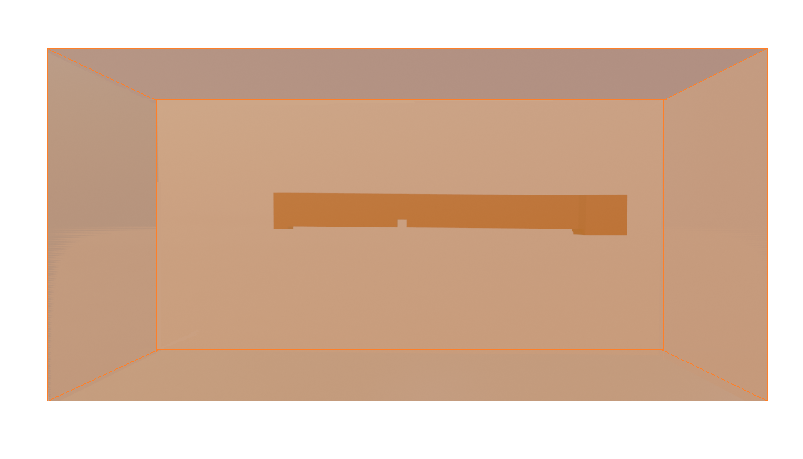
<br/>
*<sub>Background mesh created with blockMesh containing the structure to be meshed.</sub>*

In the *blockMeshDict* file the following need to be added:
- The scaling factor for the vertex coordinates.
  ```
   convertToMeters 1;
   ```
  
- Coordinates of the vertices of the background mesh.
  ```
    vertices
        (
            ( -30.0 -25.0 -25.0 )   //vertex number 0
            ( 70.0 -25.0 -25.0 )   //vertex number 1
            ( 70.0 25.0 -25.0 )   //vertex number 2
            ( -30.0 25.0 -25.0 )   //vertex number 3
            ( -30.0 -25.0 25.0 )   //vertex number 4
            ( 70.0 -25.0 25.0 )   //vertex number 5
            ( 70.0 25.0 25.0 )   //vertex number 6
            ( -30.0 25.0 25.0 )   //vertex number 7
        );
  ```
  The coordinates of the vertices are indicated following the order
  presented here below.
    
    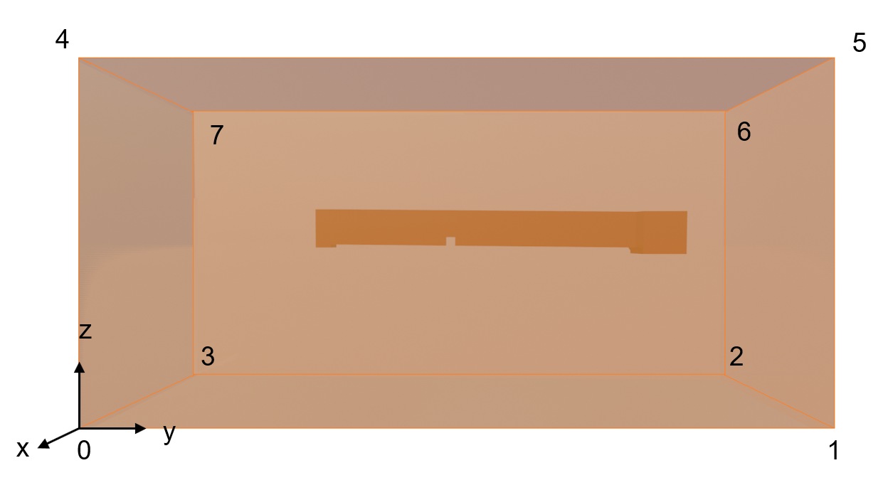
    <br/>
    *<sub>Background mesh indicating the order in which the vertices are written in the blockMeshDict file.</sub>*


- Ordered list of vertex labels and mesh size.
  ```
    blocks
        (
            hex (0 1 2 3 4 5 6 7)   // vertex numbers
            (400 200 200)   // number of cells in each direction
            simpleGrading (1 1 1) // cell expansion ratios
        );
  ```

For further details regarding the blockMesh utility please refer to 
[blockMesh](https://www.openfoam.com/documentation/user-guide/4-mesh-generation-and-conversion/4.3-mesh-generation-with-the-blockmesh-utility)
on the OpenFOAM user guide.
***
#### 2. SurfaceFeaturesDict

The surfaceFeaturesDict extracts and write all surface features to file.
In this file all the STL files that have been saved in the triSurface folder 
have to be added as follows:

```
    Air
    {
        surfaces
            ("Air.stl");
        includedAngle   180;

    // Write features to obj format for postprocessing
        writeObj                yes;
    }
```

The complete version of the surfaceFeaturesDict for the current tutorial
is saved in the case folder.
***
#### 3. decomposeParDict
The decomposeParDict is used to decompose a mesh and fields of 
a case for parallel execution. When running in parallel, the geometry has to
first be segmented into individual geometries for each MPI process.
The *numberOfSubdomains* entry is mandatory, and the *Method* 
defines the decomposition method type. Several decomposition methods are 
available. Therefore, the *decomposeParDict* file shown here below 
presents only one option as example.

```
    numberOfSubdomains 8;
    method          simple;

    simpleCoeffs
    {
        n               (2 2 2);
        delta           0.001;
    }

    hierarchicalCoeffs
    {
        n               (1 1 1);
        delta           0.001;
        order           xyz;
    }

    manualCoeffs
    {
        dataFile        "";
    }

    distributed     no;

    roots           ( );
```
<br/>

***
#### 4. SnappyHexMesh
The snappyHexMeshDict dictionary contains a series of commands that
control the various steps of the meshing process. The main ones are
summarized here below:
- *castellatedMesh*: to enable the creation of the castellated mesh.
- *snap*: to enable the surface snapping stage.
- *addLayers*: to enable the surface layer insertion.
- *geometry*: sub-dictionary of all surface geometry used.
- *castellatedMeshControls*: sub-dictionary of controls for castellated mesh.
- *snapControls*: sub-dictionary of controls for surface snapping. 
- *addLayersControls*:  sub-dictionary of controls for layer addition.
- *meshQualityControls*: sub-dictionary of controls for mesh quality.
- *mergeTolerance*: merge tolerance as a fraction of the initial bounding mesh.

The key steps involved when running snappyHexMesh are:
- *Castellation*: The cells which are beyond a region defined by a predefined point are removed
- *Snapping*: Reconstructs the cells to move the edges from inside the region to the required
boundary
- *Layering*: Creates additional layers in the boundary region.

For this example the *add Layers* option, which enables the addition of viscous 
layers, was set to *false*.
```
/*--------------------------------*- C++ -*----------------------------------*\
| =========                 |                                                 |
| \\      /  F ield         | OpenFOAM: The Open Source CFD Toolbox           |
|  \\    /   O peration     | Version:  2.2.0                                 |
|   \\  /    A nd           | Web:      www.OpenFOAM.org                      |
|    \\/     M anipulation  |                                                 |
\*---------------------------------------------------------------------------*/
FoamFile
{
    format      ascii;
    class       dictionary;
    object      snappyHexMeshDict;
}
// * * * * * * * * * * * * * * * * * * * * * * * * * * * * * * * * * * * * * //

// Which of the steps to run
castellatedMesh true;    // make basic mesh 
snap            true;    // decide to snap back to surface 
addLayers       false;   // decide to add viscous layers 
```

<br/>

The **GEOMETRY sub-dictionary** lists all the surfaces used by snappyHexMeshDict, 
with the exception of the blockMesh geometry. Additionally, it defines a name for 
each of them to be used as a reference as shown in the example here below.

```
geometry // Load all the STL files here
{
  Air.stl {type triSurfaceMesh; name Air;}
  Concrete_sides.stl {type triSurfaceMesh; name Concrete_sides;}
  Gravel_bottom.stl {type triSurfaceMesh; name Gravel_bottom;}
  Inlet.stl {type triSurfaceMesh; name Inlet;}
  Obstacle.stl {type triSurfaceMesh; name Obstacle;}
  Outlet.stl {type triSurfaceMesh; name Outlet;}
};
```
<br/>

The **CastellatedMeshControls** settings then allow the definition of the
mesh refinement. The level of refinement can be set in the *features*, 
*refinementSurfaces* and *refinementRegions* sections. 
Starting from level 0, which corresponds to no refinement, each subsequent
refinement level divides the cell in 4 parts.

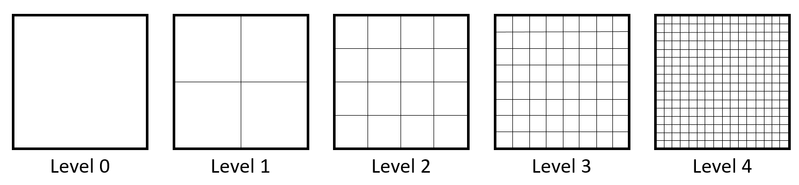
<br/>
*<sub>Example of different mesh refinement levels.</sub>*

Additionally, the following are set:
- *maxGlobalCells*: defines the overall number of cells limit.
- *maxLocalCells*: this setting is used in the case of parallel running and defines the maximum number 
  of cells for each processor.
- *nCellsBetweenLevels*: avoids having sudden cell size changes, meaning consecutive
refinement level changes close together.
  
For all further details regarding the settings please refer to the [Castellation and refinement](https://www.openfoam.com/documentation/guides/latest/doc/guide-meshing-snappyhexmesh-castellation.html#meshing-snappyhexmesh-global-castellation) 
section of the OpenFOAM User Guide.

```
castellatedMeshControls
{
    maxLocalCells 50000000;  //max cells per CPU core
    maxGlobalCells 500000000; //max cells to use before mesh deletion step
    minRefinementCells 0;  //was 0 - zero means no bad cells are allowed during refinement stages
    nCellsBetweenLevels 3;  // expansion factor between each high & low refinement zone

    // Explicit feature edge refinement
    // ~~~~~~~~~~~~~~~~~~~~~~~~~~~~~~~~

    features // taken from STL from each .eMesh file created by "SurfaceFeatureExtract" command
    (
      {file "Air.eMesh"; level 0;}
      {file "Concrete_sides.eMesh"; level 0;}
      {file "Gravel_bottom.eMesh"; level 0;}
      {file "Inlet.eMesh"; level 0;}
      {file "Obstacle.eMesh"; level 0;}
      {file "Outlet.eMesh"; level 0;}
    );

    // Surface based refinement
    // ~~~~~~~~~~~~~~~~~~~~~~~~

    refinementSurfaces // Surface-wise min and max refinement level
    {
      Air {level (0 0);}
      Concrete_sides {level (1 3);}
      Gravel_bottom {level (2 3);}
      Inlet {level (1 3);}
      Obstacle {level (3 3);}
      Outlet {level (2 3);}
    }

    resolveFeatureAngle 30;  // Resolve sharp angles // Default 30
    refinementRegions        // In descending levels of fineness
    allowFreeStandingZoneFaces true;
}
```
<br/>

In the *refinementSurfaces* section shown in the example here above, different
refinement levels were set for each constituent element. A detailed example of
the resulting refinement for the Gravel_bottom and Obstacle elements is shown here below:

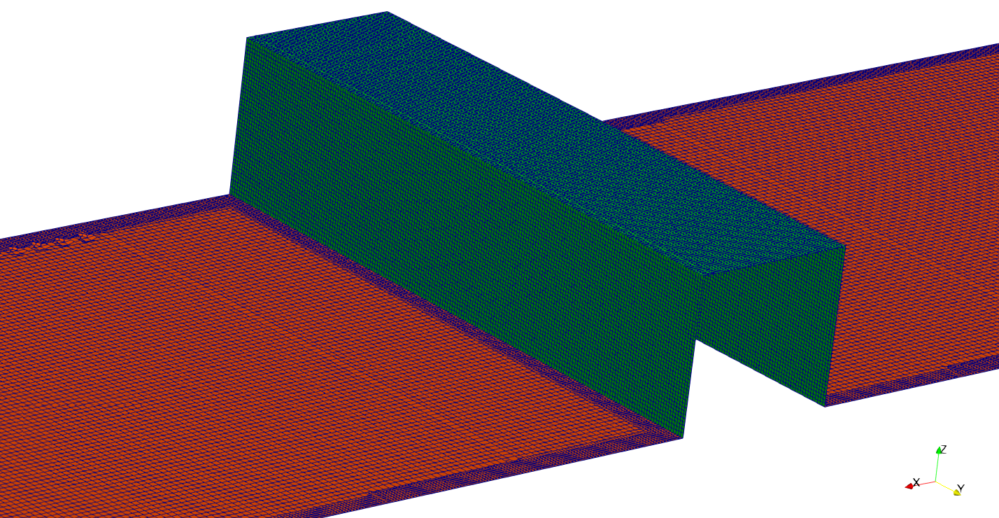
<br/>
*<sub>Resulting refinement for the **Obstacle** and **Gravel_Bottom** elements composing the mesh.</sub>*
<br/>

Once the feature and surface splitting process is complete, the cell removal 
process takes place. The latter requires one or more regions wrapped entirely
by a bounding surface belonging to the domain. In order to specify the region
in which the cells have to be kept, the *locationInMesh* keyword needs to be defined.
This vector simply defines the region that wants to be retained.
 
```
locationInMesh (43.359 5 2.5803);  //to decide which side of mesh to keep **

```

After having completed the cell splitting and cell removal processes, the 
**Snapping** process can take place. This task deals with moving the cell vertex
points on the surface to create a conforming mesh, meaning to conform the input 
geometry. Here below is a list of the keywords to be set:

- *nSmoothpatch*: defines the number of smoothing iterations along the surface.
- *tolerance*: specifies the region along the surface within which the points are attracted by the surface.
- *nSolverIter*: defines the number of mesh displacement iterations.
- *nRelaxIter*: defines the umber of relaxation iterations during the snapping.
- *nFeatureSnapIter*: defines the number of relaxation iterations used for snapping onto the features.
- *implicitFeatureSnap*: if enabled, activates the implicit feature specification.
- *explicitFeatureSnap*: if enabled, it snaps the mesh onto the features defined in the *eMesh* files.
- *multiRegionFeatureSnap*: if also *explicitFeatureSnap* is enabled, the features between multiple surfaces will be captured.
```
// Settings for the snapping.
snapControls
{
    nSmoothPatch    3;
    // nSmoothInternal $nSmoothPatch;
    tolerance       1.0;
    nSolveIter      600;
    nRelaxIter      5;

    // Feature snapping

        nFeatureSnapIter 10; // default is 10
        implicitFeatureSnap false; // default is false - detects without doing surfaceFeatureExtract
        explicitFeatureSnap true; // default is true
        multiRegionFeatureSnap true; // deafault is false - detects features between multiple surfaces
}
```
<br/>

In the case in which some irregular cells are present along the boundaries in
the mesh obtained with the snapping stage, it is possible to introduce
additional layers composed of hexahedral cells along the boundary. This stage 
includes shrinking the existing mesh in order to insert the layer of cells.

The user can choose between 4 different layer thickness parameters: *expansionRatio*,
*finalLayerThickness*, *firstLayerThickness*, *thickness*.
In this case the user must specify only two to avoid an over-specification of
the problem.

Here below some keywords are explained. For further details please refer
to the [layer addition](https://www.openfoam.com/documentation/guides/latest/doc/guide-meshing-snappyhexmesh-layers.html#snappyhexmesh-layers-relativeSizes)
section of the OpenFOAM User Guide.

- *expansionRatio*: necessary in order to calculate the relative size to the prescribed thickness of either first or final layer.
- *minThickness*: indicates the minimum thickness of the layer.
- *featureAngle*: represents the value above which the mesh is not extruded.
- *nRelaxIter*: indicates the number of relaxation steps.
- *minMedialAxisAngle*: indicates the minimum angle to select the medial axis points


```
// Settings for the layer addition.

addLayersControls 
//add the PATCH names from inside the STL file so STLpatchName_insideSTLName
 {
    relativeSizes false; 
    layers
    {
    }

    expansionRatio 1.0;
    finalLayerThickness 0.3; 
    minThickness 0.25; 
    nGrow 0; 

    // Advanced settings

    featureAngle 150;
    nRelaxIter 3  
    nSmoothSurfaceNormals 50;
    nSmoothNormals 3;
    nSmoothThickness 10; 
    maxFaceThicknessRatio 0.5; 
    maxThicknessToMedialRatio 0.3; 
    minMedianAxisAngle 90; 
    nBufferCellsNoExtrude 0;   
    nLayerIter 50; 
    NnRelaxedIter 20;
 }
```
<br/>

The final part of the *snappyHexMeshDict* file deals with the **Mesh Quality**.
In this section, the values of the extrema encountered in during the meshing
process are defined. The purpose is to ensure the adequate quality of the 
resulting mesh. The keywords that can be defined are summarized here below:
- *maxNonOrtho*: maximum face non-orthogonality angle
- *maxBoundarySkewness*: maximum boundary skewness
- *maxInternalSkewness*: maximum internal face skewness
- *maxConcave*: maximum cell concavity
- *minVol*: minimum cell pyramid volume
- *minTetQuality*: minimum tetrahedron quality
- *minArea*: minimum face area
- *minDeterminant*: minimum cell determinant
- *minFaceWeight*: minimum face interpolation weight
- *nSmoothScale*: smoothing iterations
- *errorReduction*: error reduction 

```
// Generic mesh quality settings

meshQualityControls
{
    maxNonOrtho 65;
    maxBoundarySkewness 20;
    maxInternalSkewness 4;
    maxConcave 80;
    minVol 1e-13;
    minTetQuality 1e-15;
    minArea -1;
    minTwist 0.02;
    minDeterminant 0.001;
    minFaceWeight 0.05;
    minVolRatio 0.01;
    minTriangleTwist -1;

    // Advanced
    nSmoothScale 4;
    errorReduction 0.75;
}

debug 0;

mergeTolerance 1E-6;
```
***

<br/>

Once the necessary keywords have been defined in the required dictionaries, the final 
step consists in **running the commands** in the terminal in the following order:

- Run the ```blockMesh``` command to create the background mesh:
```
user@user123:~/OpenFOAM-9/channel/Mesh$ blockMesh
```
- Run the ```surfaceFeatures``` command to create the *.obj* and *.eMesh*
  files from the initially imported STL files. These files are stored in
  the *extendedFeatureEdgeMesh* folder (channel/constant/extendedFeatureEdgeMesh).
  ```
  user@user123:~/OpenFOAM-9/channel/Mesh$ surfaceFeatures
  ```
- In the case of parallel runs, run the ```decomposePar``` command to 
decompose the geometry into individual geometries for each MPI process.
  ```
  user@user123:~/OpenFOAM-9/channel/Mesh$ decomposePar
  ```
- Run the ```snappyHexMesh``` command to generate the mesh:
  ```
  In the case of parallel runs (substitute "x" with the number of cores):
  user@user123:~/OpenFOAM-9/channel/Mesh$ mpirun -np x snappyHexMesh -parallel

  Alternatively:
  user@user123:~/OpenFOAM-9/channel/Mesh$ snappyHexMesh
  ```
- In the case of parallel runs, run the ```reconstructParMesh``` command to 
reconstruct the geometry.
  ```
  user@user123:~/OpenFOAM-9/channel/Mesh$ reconstructparMesh -constant
  ```
- Finally, the quality of the generated mesh can be analyzed by typing the 
  ```checkMesh```.
  ```
  user@user123:~/OpenFOAM-9/channel/Mesh$ checkMesh
  ```
  In the case of a successful mesh generation, it should return the following:
  ```
  Checking topology...
    Boundary definition OK.
    Cell to face addressing OK.
    Point usage OK.
    Upper triangular ordering OK.
    Face vertices OK.
    Number of regions: 1 (OK).

  Checking patch topology for multiply connected surfaces...
                   Patch    Faces   Points                  Surface topology
                     Air    12879    13927  ok (non-closed singly connected)
          Concrete_sides   103621   109304  ok (non-closed singly connected)
           Gravel_bottom   132062   136819  ok (non-closed singly connected)
                   Inlet      288      339  ok (non-closed singly connected)
                Obstacle    27076    27416  ok (non-closed singly connected)
                  Outlet    20610    21252  ok (non-closed singly connected)

  Checking geometry...
    Overall domain bounding box (-2.5 -1e-06 -1) (56.7409 10 6.2461)
    Mesh has 3 geometric (non-empty/wedge) directions (1 1 1)
    Mesh has 3 solution (non-empty) directions (1 1 1)
    Boundary openness (-5.71676e-15 7.42351e-15 8.33816e-16) OK.
    Max cell openness = 4.76547e-16 OK.
    Max aspect ratio = 7.03771 OK.
    Minimum face area = 3.89097e-05. Maximum face area = 0.0910262.  Face area magnitudes OK.
    Min volume = 2.62118e-06. Max volume = 0.0180894.  Total volume = 2271.44.  Cell volumes OK.
    Mesh non-orthogonality Max: 47.7783 average: 6.72481
    Non-orthogonality check OK.
    Face pyramids OK.
    Max skewness = 3.12739 OK.
    Coupled point location match (average 0) OK.

  Mesh OK.

  End
  ```
- The generated meh can be visualized in ParaView by typing ```paraFoam``` in the terminal.
  ```
  user@user123:~/OpenFOAM-9/channel/Mesh$ paraFoam
  ```
<br/>

***
#### 5. Mesh visualization  

In order to visualize the generated mesh in ParaView, select the *Apply* option
in the *Properties* section.

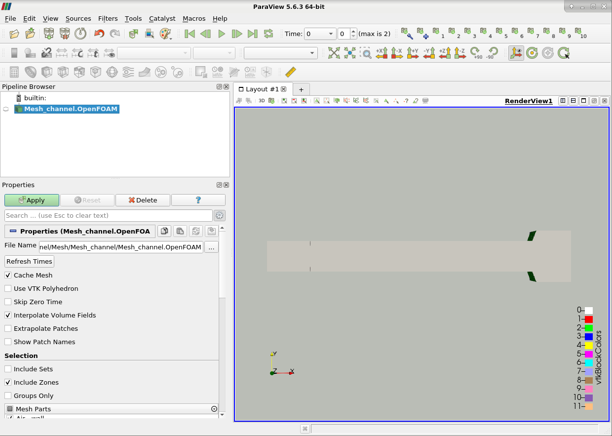
<br/>
*<sub>Visualization of the resulting mesh in ParaView.</sub>*
<br/>

The image here below highlights some features required to adequately
visualize the created mesh. Firstly, to analyze the cells, it is possible
to select the option *Surface with Edges*. The various elements composing
the mesh can then be selected/deselected to analyze specific parts in detail.
Finally, in the case in which the Mesh Check returned some errors, for instance 
faces with high skewness, they can be visualized by selecting the *Include Sets* option.

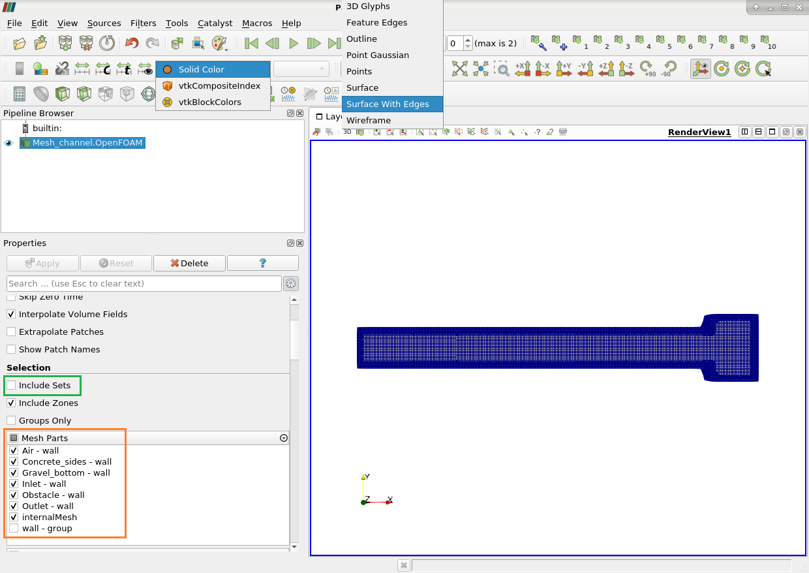
<br/>
*<sub>Visualization of the resulting mesh in ParaView, highlighting the created cells.</sub>*
<br/>
***

### Case set-up
When setting up the case folder, edits need to be done to the following files:
- In the *Constant* folder: the various properties files and the boundary file in
the *polyMesh* folder.
- In the *System* folder: the setFieldsDict, fvSchemes, fvSolution and controlDict files.
- In the *0* folder: all the containing files.

 <br/>

#### 1. The *Constant* Subdirectory
After having copied the *polyMesh* folder from the *snappyHexMesh* results,
it is necessary to correctly define the type of the different composing elements
in the **boundary** file,. For instance, in the example here below, the 
*Gravel_bottom* element was defined as *wall* whereas the *Inlet* was defined as 
a *patch*. 
  ```
FoamFile
{
    format      ascii;
    class       polyBoundaryMesh;
    location    "constant/polyMesh";
    object      boundary;
}
// * * * * * * * * * * * * * * * * * * * * * * * * * * * * * * * * * * * * * //

...
 
    Gravel_bottom
    {
        type            wall;
        inGroups        List<word> 1(wall);
        nFaces          132062;
        startFace       5105689;
    }
    Inlet
    {
        type            patch;
        inGroups        List<word> 1(wall);
        nFaces          288;
        startFace       5237751;
    }
    
 ...
  ```
Different patch types are available in OpenFOAM. For a detailed explanation 
refer to the [boundaries](https://www.openfoam.com/documentation/user-guide/4-mesh-generation-and-conversion/4.2-boundaries)
section of the OpenFOAM User Guide. 
- *patch*: generic patch
- *symmetryPlane*: plane of symmetry
- *empty*: from and back planes of a 2D geometry
- *wedge*: wedge front and back for an axi-symmetric geometry
- *cyclic*: cyclic plane
- *wall*: used to define wall functions in turbulent flow
- *processor*: inter-processor boundary

The following files that need to be added are the ones defining the case properties.
The list of property files for the present case are summarized
in the image here below.
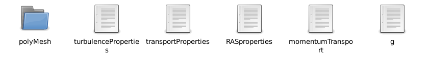
<br/>
*<sub>Contents of the constant folder.</sub>*
<br/>

In the *turbulenceProperties* files, the turbulence model
is defined. OpenFOAM includes support for the following types 
of turbulence modelling:
- Reynolds Averaged Simulation (RAS),
- Detached Eddy Simulation (DES), and
- Large Eddy Simulation (LES)

```
simulationType  RAS;

RAS
{
    RASModel        kEpsilon;

    turbulence      on;

    printCoeffs     on;
}
```

The *transportProperties* file defines the properties of the two
phases considered in the present case (air and water) and
the surface tension between the two phases.
```
phases (water air);

water
{
    transportModel  Newtonian;
    nu              [0 2 -1 0 0 0 0] 1e-06;
    rho             [1 -3 0 0 0 0 0] 1000;
    CrossPowerLawCoeffs
    {
        nu0             nu0 [ 0 2 -1 0 0 0 0 ] 1e-06;
        nuInf           nuInf [ 0 2 -1 0 0 0 0 ] 1e-06;
        m               m [ 0 0 1 0 0 0 0 ] 1;
        n               n [ 0 0 0 0 0 0 0 ] 0;
    }

    BirdCarreauCoeffs
    {
        nu0             nu0 [ 0 2 -1 0 0 0 0 ] 0.0142515;
        nuInf           nuInf [ 0 2 -1 0 0 0 0 ] 1e-06;
        k               k [ 0 0 1 0 0 0 0 ] 99.6;
        n               n [ 0 0 0 0 0 0 0 ] 0.1003;
    }
}

air
{
    transportModel  Newtonian;
    nu              [0 2 -1 0 0 0 0] 1.48e-05;
    rho             [1 -3 0 0 0 0 0] 1;
    CrossPowerLawCoeffs
    {
        nu0             nu0 [ 0 2 -1 0 0 0 0 ] 1e-06;
        nuInf           nuInf [ 0 2 -1 0 0 0 0 ] 1e-06;
        m               m [ 0 0 1 0 0 0 0 ] 1;
        n               n [ 0 0 0 0 0 0 0 ] 0;
    }

    BirdCarreauCoeffs
    {
        nu0             nu0 [ 0 2 -1 0 0 0 0 ] 0.0142515;
        nuInf           nuInf [ 0 2 -1 0 0 0 0 ] 1e-06;
        k               k [ 0 0 1 0 0 0 0 ] 99.6;
        n               n [ 0 0 0 0 0 0 0 ] 0.1003;
    }
}

sigma           [1 0 -2 0 0 0 0] 0.072;
```

When selecting the RAS turbulence model, also the *RASproperties*
sub-dictionary must be added. This file contains the keywords defining
the name of the RAS turbulence model, the option to either turn
the turbulence modelling on or off and the switch to print the model 
coefficients to the terminal at the simulation startup.

```
RASModel        kEpsilon;
turbulence      on;
printCoeffs     on;
```

The *momentumTransport* dictionary is read by any solver that includes 
turbulence modelling. The keywords defined in this sub-dictionary are
the same as the above-described ones. 

```
simulationType  RAS;

RAS
{
    model           kEpsilon;
    turbulence      on;
    printCoeffs     on;
}
```
Turbulence models can be listed by running a solver 
with the *-listMomentumTransportModels* option:
```
user@user123:~/OpenFOAM-9/channel/$ interFoam -listMomentumTransportModels
```

Finally, the *g* sub-dictionary simply defines the 
gravitational acceleration and the used units.

```
dimensions      [ 0 1 -2 0 0 0 0 ];
value           ( 0 0 -9.8065 );
```

***

#### 2. The *System* Directory


The *System Folder* contains the parameters associated
with the solution procedure itself. The mandatory files
for running the simulation are the *controlDict* in which
the run control parameters are set and those for data
output; the *fvSchemes* where the discretization schemes
used in the solution can be selected at run-time and the
*fvSolution* in which the equation solvers, tolerances 
and other algorithm controls are set.
Additionally, the *setFieldsDict* is also added, which enables the user
to set values on a selected set of cells/patch-faces.


In *controlDict* file several control parameters can be set as, for
instance, the start, end time and time step dT of the simulation.
In particular when running a cold start simulation (i.e., a case in which
the channel is initially dry) the time step should be set to *adjustable* 
enabling the adjustment of the time step according to maximum Courant number
in the transient simulation. Additionally, also the maximum value of the Courant
number *maxCo* and the maximum value at the interface *maxAlphaCo* should be assigned.

```
application     interFoam;
startFrom       startTime;
startTime       0;
stopAt          endTime;
endTime         3600;
deltaT          0.1;
writeControl    adjustableRunTime;
writeInterval   1;
purgeWrite      0;
writeFormat     binary;
writePrecision  6;
writeCompression uncompressed;
timeFormat      general;
timePrecision   6;

runTimeModifiable yes;
adjustTimeStep  yes;

maxCo           1.0;
maxAlphaCo      1.0;
maxDeltaT       1.0;
```

The *fvSchemes* dictionary in the system directory sets the numerical
schemes for the terms that appear in the application that is being run.
For the time schemes *ddtSchemes*, apart from the first-order accurate Euler scheme, other options are for 
instance the second-order Crank-Nicholson and backward schemes.
The gradient schemes *gradSchemes* are then defined. The available schemes are
the Gauss gradient scheme and the Least-squares gradient scheme.
The interpolation scheme can be either cell-based linear (linear) or
point-based linear (pointLinear) or least squares (leastSquares).
The divergence scheme to be used can be defined with the *divSchemes*
keyword. Detailed information regarding the available options and
corresponding syntax can be found in the [divergence schemes](https://www.openfoam.com/documentation/guides/latest/doc/guide-schemes-divergence.html)
of the OpenFOAM User Guide.
For the *laplacianSchemes*, all options are based on the application of the
Gauss theorem, requiring thus an interpolation scheme to transform the coefficients 
from cell values to the faces, and a surface-normal gradient scheme.
The *interpolationSchemes* are required to transform cell-centre quantities to face centres
Several interpolation schemes are available, from the ones based uniquely on the geometry
to for example convection schemes that are a function of the local flow.
```
ddtSchemes
{    default         Euler;}

gradSchemes
{    default         Gauss linear;}

divSchemes
{
    div(rhoPhi,U)   Gauss linearUpwind grad(U);
    div(phi,alpha)  Gauss interfaceCompression vanLeer 1;
    div(phi,k)      Gauss upwind;
    div(phi,epsilon) Gauss upwind;
    div(((rho*nuEff)*dev2(T(grad(U))))) Gauss linear;
}

laplacianSchemes
{    default         Gauss linear corrected;}

interpolationSchemes
{    default         linear;}

snGradSchemes
{    default         corrected;}

wallDist
{    method meshWave;}
```

The *fvSolution* files contains a set of sub-dictionaries that
are specific to the solver being run. Additionally, there is also
a set of standard sub-dictionaries, including the *solvers*,
*relaxationFactors*, *PISO* and *SIMPLE*, that cover most of the ones
used by the standard solvers. An example of the set of entries required for
the interFoam solver can be found in the [case folder](https://github.com/hydro-informatics/openfoam.git)
(*Simulation* folder). 
A detailed overview of all available options can be found in the OpenFOAM User Guide
[(Solution and Algorithm Control)](https://www.openfoam.com/documentation/user-guide/6-solving/6.3-solution-and-algorithm-control).

The *setFieldsDict* allows the user to assign a certain value to a 
selected set of cells/patch-faces. For the present tutorial this dictionary
was used to assign an initial water level to the inlet of the model.
Multiple options are available for selecting the cells of interest.
In the example shown below the *boxToCell* option was selected, which
selects all cells whose cell centre is located inside the given bounding box
```
defaultFieldValues
(
    volScalarFieldValue alpha.water 0
);

regions    // Select based on surface
(
    boxToCell
    {
        box (-3.6 5.1 -2.5) (0.4 -4.0 1.2);
        fieldValues
        (
            volScalarFieldValue alpha.water 1
        );
    }
);
```
Alternatively, other sources can be used such as *fieldToCell* which selects all cells
characterized by a field value within the selected range [min; max]. A very useful option
when setting the initial water level is also the *surfaceToCell* source that selects the
cells using a surface, meaning based on an imported STL surface. In this case the dictionary
would look like:
```
defaultFieldValues
(
    volScalarFieldValue alpha.water 0
);

regions    // Select based on surface
(
  surfaceToCell
      {
          file            "./constant/triSurface/water.stl";
          outsidePoints   ((x y z));
          includeCut      true;
          includeInside   true;
          includeOutside  false;
          nearDistance    -1;
          curvature       -100;
          fieldValues
          (
              volScalarFieldValue MangrovesIndex 1
          );
      }
 );
```
The *outsidePoints* keyword defines the outside of the surface. *IncludeCut*, *includeInside* and 
*IncludeOutside* are instead booleans that determine whether to include in the selection the cells
cut by the surface, the cells inside the surface and outside the surface respectively. The *nearDistance* keyword
is a scalar that determines which cells with the center near to the surface to include. Finally, 
*curvature* includes the cells close to a strong curvature on the surface.

A complete list of all available sources can be found in the [OpenFOAM Wiki](https://openfoamwiki.net/index.php/TopoSet)
in the TopoSet section.

#### 3. The *0* Directory
The *0* directory is the time directory containing the files describing the 
initial conditions of the simulation. Inside this directory one text file
for each field that is required for the interFoam solver executable is stored.
In the present case these files include: *U* for the flow velocity, *p_rgh* for
the dynamic pressure, *nut* for the turbulent viscosity, *k* for the turbulent 
kinetic energy, *epsilon* for the rate of dissipation of turbulent kinetic energy and 
*alpha.water.orig* for the initial phases. The complete version of the files used
for this tutorial can be found in the [Case Folder]().

<br/>

**U field Dictionary**

This dictionary defines the boundary conditions and initial set up for the
vector field U. For the *internalField* uniform initial conditions with a value
of (0 0 0) were set. For all remaining walls and patches, the following were
assigned:
- **Air patch** : *pressureInletOutletVelocity* condition, which assigns a zero gradient
condition to the flow out of the domain and a velocity based on the flux in the patch-normal
  direction to the flow into the domain.
- **Concrete_sides, Gravel_bottom and Obstacle patches**: *noSlip* condition. The
patch velocity is set to (0 0 0)
- **Inlet patch**: a *flowRateInletVelocity* condition was chosen. This allows to define
  the volumetric or mass flow rate at the inlet patch.
- **Outlet patch**: a *zeroGradient* boundary condition was set. The internal
values are therefore extrapolated to the boundary face.
```
dimensions      [0 1 -1 0 0 0 0]; //kg m s K mol A cd
internalField   uniform (0 0 0);

boundaryField
{
     Air
        {
        	type            pressureInletOutletVelocity;
         	value           uniform (0 0 0);
        }

     Concrete_sides
        {
        	type            noSlip;
        }

     Gravel_bottom
        {
        	type            noSlip;
        }

     Inlet
        {
        	type            flowRateInletVelocity;
        	volumetricFlowRate constant 0.5;
	}

     Obstacle
        {
        	type            noSlip;
        }

     Outlet
        {
                type            zeroGradient;
        }
}
```

<br/>

**p_rgh field Dictionary**

This dictionary defines the boundary conditions and initial set up for the
dimensional field p_rgh, expressed in Pa. The *internalField* was initialized with
a 0 value in the entire domain. The remaining fields were set as follows:
- **Air patch**: the *totalPressure* was assigned. This condition sets the static
pressure at the patch based on the specification of the total pressure and it 
allows to adequately represent the atmospheric pressure.
- **All other patches**: the condition used was a *fixedFluxPressure* boundary.
This boundary condition is utilized as an alternative to *zeroGradient*, in the cases
  in which also the gravity and surface tension are present in the solution equations.
  
```
dimensions      [1 -1 -2 0 0 0 0];//kg m s K mol A cd
internalField   uniform 0;//initially atmospheric pressure in the entire domain

boundaryField
{
     Air
        {
        	type            totalPressure;
        	p0              uniform 0;
        }

     Concrete_sides
        {
        	type            fixedFluxPressure;
        	value           uniform 0; 
        }

     Gravel_bottom
        {
        	type            fixedFluxPressure;
        	value           uniform 0;
        }

     Inlet
        {
        	type            fixedFluxPressure;
        	value           uniform 0;
	}

     Obstacle
        {
        	type            fixedFluxPressure;
        	value           uniform 0;
        }

     Outlet
        {
                type            fixedFluxPressure;
        	value           uniform 0;
        }
}
```

<br/>

**nut field Dictionary**

This dictionary defines the boundary conditions and initial set up for the
turbulent viscosity nut, expressed in m2/s. The *internalField* was initialized
with a 0 value in the entire domain. The remaining fields were set as shown here below:
- **Air, Inlet and Outlet patch**: the condition was set to *calculated*, meaning that
  no value is prescribed and that it is calculated from the turbulence model and
  the values for k and epsilon in this case.
- **All remaining walls**: the *nutkRoughWallFunction* boundary condition was applied.
This boundary condition provides a wall constraint on the turbulent viscosity. This allows
 to account for the effects of roughness. The implementation of the different 
 materials present in the model was done by defining the different roughness 
  heights ks (e.g., 0.0052 for the concrete walls).

```
dimensions      [0 2 -1 0 0 0 0];
internalField   uniform 0;

boundaryField
{

    Air
    {
      type            calculated;
      value           uniform 0;
    }

    Concrete_sides
    {
      type            nutkRoughWallFunction;
      Ks              uniform 0.0052;
      Cs              uniform 0.5;
      value           uniform 0;
    }

    Gravel_bottom
    {
      type            nutkRoughWallFunction;
      Ks              uniform 0.15;
      Cs              uniform 0.5;
      value           uniform 0;
    }

    Inlet
    {
      type            calculated;
      value           uniform 0;
    }

    Obstacle
    {
      type            nutkRoughWallFunction;
      Ks              uniform 0.0052;
      Cs              uniform 0.5;
      value           uniform 0;
    }

    Outlet
    {
        type            calculated;
        value           uniform 0;
    }
}
```

<br/>

**k field Dictionary**

This dictionary defines the boundary conditions and initial set up for the
turbulent kinetic energy k, expressed in m<sup>2</sup>/s. The *internalField* was initialized
with a uniform value in the entire domain. The remaining fields were set as shown here below:
- **Air and Outlet patch**: the condition was set to *inletOutlet*, which corresponds
  to the *zeroGradient* condition, with the exception of the case in which the 
  velocity vector next to the boundary is directed inside the domain. In the latter
  case it switches to a *fixedValue* condition.
- **Inlet patch**:  in this case the assigned boundary condition was *fixedValue*. 
  The corresponding value was the one assigned to the internalField.
- **All remaining walls**: the *kqRWallFunction* boundary condition was applied.
This boundary condition provides a simple wrapper around the zero-gradient condition.
*k* stands for the turbulent kinetic energy, *q* for the square-root of the turbulent kinetic 
 energy and *R* for the Reynolds stress tensor.

```
dimensions      [0 2 -2 0 0 0 0];
internalField   uniform 1.22e-03;

boundaryField
{
    Air
  {
      type            inletOutlet;
      inletValue      $internalField;
      value           $internalField;
  }

  Concrete_sides
  {
    type            kqRWallFunction;
    value           $internalField;
  }

  Gravel_bottom
  {
    type            kqRWallFunction;
    value           $internalField;
  }

  Inlet
  {
    type            fixedValue;
    intensity       0.05;
    value           $internalField;
  }

  Obstacle
  {
    type            kqRWallFunction;
    value           $internalField;
  }

  Outlet
  {
      type            inletOutlet;
      inletValue      $internalField;
      value           $internalField;
  }
}
```

<br/>

**epsilon field Dictionary**

This dictionary defines the boundary conditions and initial set up for the
rate of dissipation of turbulent kinetic energy epsilon, expressed in m<sup>2</sup>/s<sup>3</sup>.
The *internalField* was initialized with a uniform value in the entire domain. 
The remaining fields were set as shown here below:
- **Air and Outlet patch**: the condition was set to *inletOutlet* as described above
  for k.
- **Inlet patch**:  also in this case the boundary condition assigned to the *inlet* patch
  was *fixedValue*, corresponding to the internalField value.
- **All remaining walls**: the *epsilonWallFunction* boundary condition was applied.
This boundary condition provides a wall constraint on the turbulent kinetic energy
  dissipation rate and the turbulent kinetic energy production contribution for low
  and high Reynolds number turbulence models.

```
dimensions      [0 2 -3 0 0 0 0];
internalField   uniform 3.20e-05;

boundaryField
{
    Air
    {
        type            inletOutlet;
        inletValue      $internalField;
        value           $internalField;
    }

    Concrete_sides
    {
      type            epsilonWallFunction;
      value           $internalField;
    }

    Gravel_bottom
    {
      type            epsilonWallFunction;
      value           $internalField;
    }

    Inlet
    {
      type            fixedValue;
      value           $internalField;
    }

    Obstacle
    {
      type            epsilonWallFunction;
      value           $internalField;
    }

    Outlet
    {
        type            inletOutlet;
        inletValue      $internalField;
        value           $internalField;
    }
}
```

<br/>

**alpha.water field Dictionary**

This dictionary defines the boundary conditions and initial conditions for the
non-dimensional field alpha.water.
The *internalField* was initialized with a uniform value equal to 0 in the entire domain,
meaning no water is present in the domain at time 0. The water will then be initialized 
running the *setFields* command with the settings defined in the corresponding dictionary.
The remaining fields were set as shown here below:
- **Air patch**: the condition was set to *inletOutlet* which avoid the possibility of water
  back-flowing into the domain. In the case in which th flow is exiting, a *zeroGradient* 
  condition is applied and if the flow is returning a value equal to the one defined as *inletValue*.
- **Inlet patch**:  also in this case the boundary condition assigned was *fixedValue*, 
  corresponding to a uniform value of 1, meaning the entire patch is only composed by water
  (no air phase present).
- **Outlet patch and all remaining walls**: a *zeroGradient* boundary condition was applied. In this case
the internal values are extrapolated to the boundary face.
```
dimensions      [0 0 0 0 0 0 0];

internalField   uniform 0;

boundaryField
{
  Air
  {
    type            inletOutlet;
    inletValue      uniform 0;
    value           uniform 0;
  }

  Concrete_sides
  {
    type            zeroGradient;
  }

  Gravel_bottom
  {
    type            zeroGradient;
  }

  Inlet
    {
        type            fixedValue;
        value           uniform 1;
    }

  Obstacle
  {
    type            zeroGradient;
  }

    Outlet
  {
    type            zeroGradient;
  }
}
```

<br/>

***
### Running the case

After having correctly created and filled in all the necessary dictionaries, the case
can finally be run. 
- The first step consists in initializing a region containing water as defined in the
*setFieldsDict* file.
  ```
  user@user123:~/OpenFOAM-9/channel/Simulation$ setFields
  ``` 
- In the case of parallel runs, run the decomposePar command, as done during the meshing
  process, to decompose the geometry   into individual geometries for each MPI process.
  ```
  user@user123:~/OpenFOAM-9/channel/Simulation$ decomposePar
  ``` 
- Start running the simulation by typing the following in the terminal window:  
 ```
  In the case of parallel runs (substitute "x" with the number of cores):
  user@user123:~/OpenFOAM-9/channel/Simulation$ mpirun -np x interFoam -parallel
  
  Alternatively:
  user@user123:~/OpenFOAM-9/channel/Simulation$ interFoam
  ```

<br/>

Here below an example of the output screen of the *interFoam* solvers is shown.
The main aspects to be mentioned are the following:
- The first line shows the mean and maximum flow Courant number.
- Line 2 shows instead the interface Courant number which is more restrictive than the
previous and should be kept below 1 when solving multiphase flows.
- "MULES: Correcting alpha.water" depends on the value set to *nAlphaCorr* set in the *fvSolution* file.
- lines 7 and 9 refer to the *nAlphaSubCycles* which was set to 1, meaning only one loop.
- lines 11, 13 and 15 refer to the three pressure correctors and no non-orthogonal 
corrections are present.
- As shown in line 16 a tighter tolerance is applied only to this iteration (p_rghFinal)
  
```
1    Courant Number mean: 0.00233217 max: 0.961058
2    Interface Courant Number mean: 0.000313967 max: 0.234243
3    deltaT = 0.000461857
4    Time = 148.004
5 
6    smoothSolver:  Solving for alpha.water, Initial residual = 2.35103e-05, Final residual = 1.00306e-08, No Iterations 1
7    Phase-1 volume fraction = 0.144966  Min(alpha.water) = -1.2641e-05  Max(alpha.water) = 1
8    MULES: Correcting alpha.water
9    MULES: Correcting alpha.water
10   Phase-1 volume fraction = 0.144966  Min(alpha.water) = -2.71177e-05  Max(alpha.water) = 1
11   DICPCG:  Solving for p_rgh, Initial residual = 0.000249542, Final residual = 1.17508e-05, No Iterations 6
12   time step continuity errors : sum local = 8.05179e-08, global = 6.39537e-10, cumulative = -2.18471e-08
13   DICPCG:  Solving for p_rgh, Initial residual = 2.05956e-05, Final residual = 1.01515e-06, No Iterations 58
14   time step continuity errors : sum local = 6.95406e-09, global = -1.17766e-09, cumulative = -2.30247e-08
15   DICPCG:  Solving for p_rgh, Initial residual = 2.95498e-06, Final residual = 9.64318e-08, No Iterations 75
16   time step continuity errors : sum local = 6.60043e-10, global = 5.94012e-11, cumulative = -2.29653e-08
17   smoothSolver:  Solving for epsilon, Initial residual = 0.0002476, Final residual = 5.94123e-06, No Iterations 1
18   bounding epsilon, min: -3.63319e-06 max: 21370 average: 8.9958
19   smoothSolver:  Solving for k, Initial residual = 0.000103198, Final residual = 1.17097e-06, No Iterations 1
20   ExecutionTime = 63.45 s  ClockTime = 64 s
```

### Post-processing of the simulation results

In the case in which the simulations were run in parallel, before post-processing the data,
the first step consists in reconstructing all solution steps of the analyzed case.
This can either be done for all time steps or only for a specific one. The commands
that need to be typed in the terminal window are shown here below:
 ```
  To reconstruct all solution steps:
  user@user123:~/OpenFOAM-9/channel/Simulation$ reconstructPar
  
  To reconstruct a specific time step (substitute "x" with the time step):
  user@user123:~/OpenFOAM-9/channel/Simulation$ reconstructPar -time x
  ```

Once the case has been reconstructed, as for the meshing process, the following command should
be used to visualize the case in ParaView:
 ```
  user@user123:~/OpenFOAM-9/channel/Simulation$ paraFoam
 ```

The *channel.OpenFOAM* should now be present in the Pipeline Browser and to visualize it in
the layout the *Apply* button can be used. Additionally, in the *Fields* section, the various
fields that can be visualized are shown and can be selected/deselected according to
the focus of the analysis.

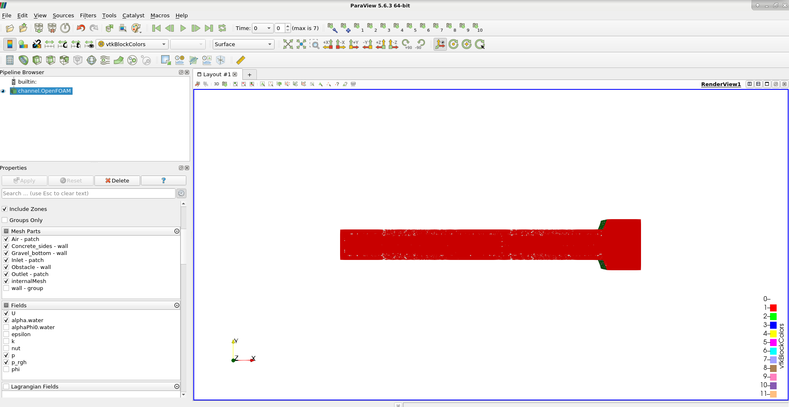
<br/>
*<sub>Visualization of the case results in ParaView.</sub>*

In order to visualize the air and water phases, *alpha.water* should then be selected in the
drop-down menu as shown in the image.

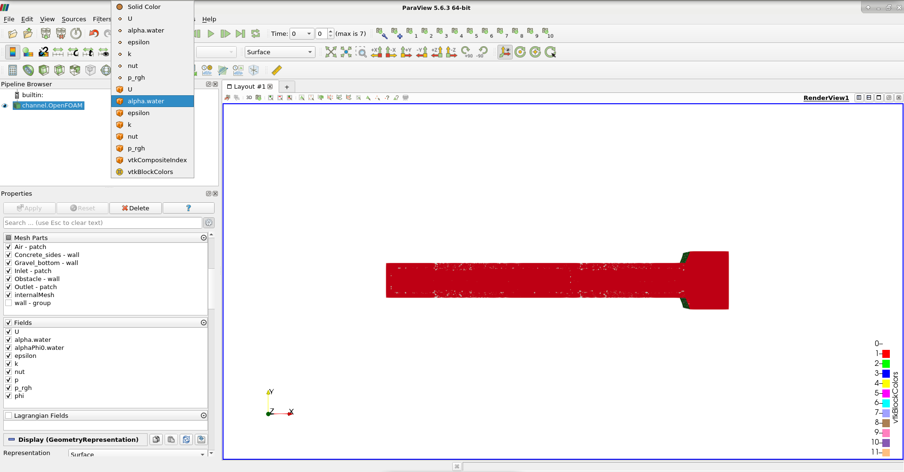
<br/>
*<sub>Enabling the setting for viewing the air and water phases in ParaView.</sub>*

To change the shown time step, the arrows that can be seen in the area 
highlighted in red can be used.


<br/>
*<sub>Options for changing the time step to be visualized.</sub>*

Next, to visualize only the water phase, the *Clip* filter is used. This can
either be found in the *Filters* section in the menu or alternatively the shortcut
can be used. The *Clip Type* should be set to *Scalar*, selecting *alpha.water* as
scalar and setting the value to 0.5, which represents the interface between air and
water. To view the air phase the *Invert* option should be selected whereas for the
water phase it should be deselected.

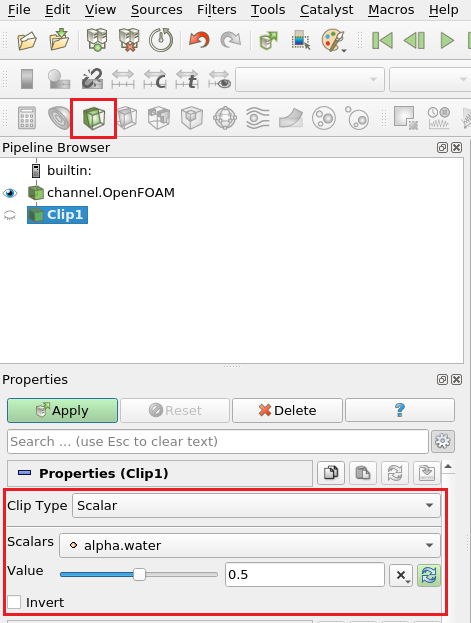
<br/>
*<sub>Clip filter used for viewing the water phase in ParaView.</sub>*

Finally, to also add the walls and patches to the view, the *Extract Block*
filter can be implemented (click on the *channel.OpenFOAM* file before applying it).


<br/>
*<sub>List of filters available in ParaView, highlighting ExtractBlock.</sub>*

The patches of interest can the be either selected or deselected and the *Coloring*
can be set to Solid Color.

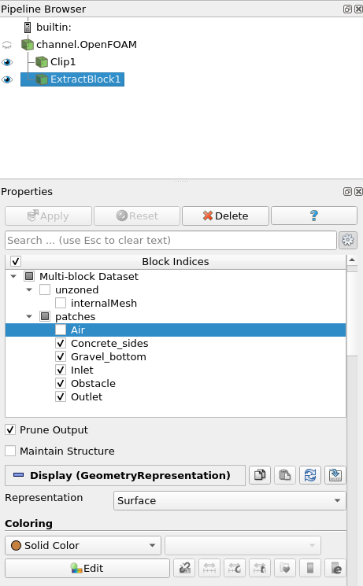
<br/>
*<sub>Available options for selecting the patches and changing the color.</sub>*

The resulting view of the water phase and block extraction is shown here below:

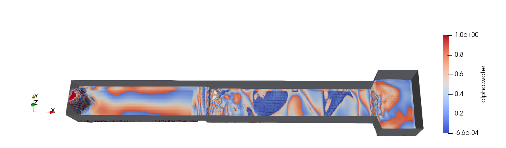
<br/>
*<sub>Simulation results highlighting the water phase.</sub>*

Different parameters can also be viewed, such as the flow velocity, and this
can be done in the *Coloring* section by selecting *U*. The *preset* can be
modified to better view the results by selecting the corresponding icon 
(highlighted in green).

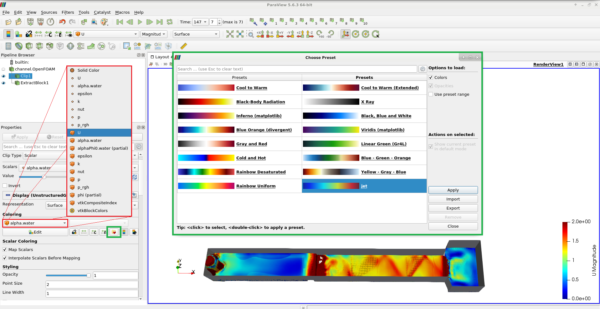
<br/>
*<sub>Simulation results highlighting the flow velocity.</sub>*


